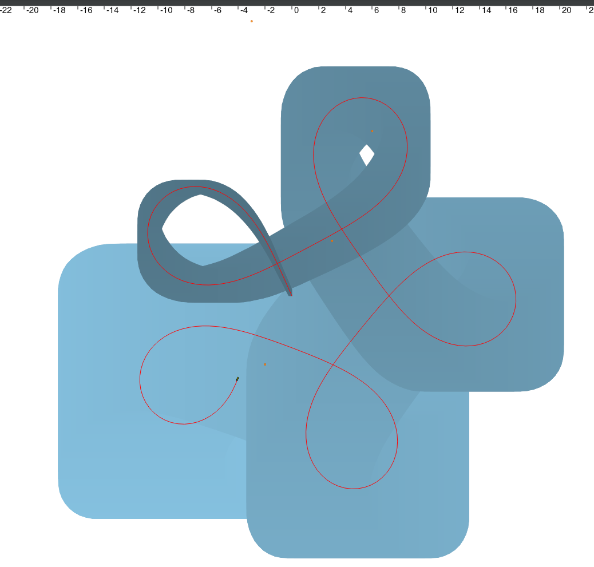
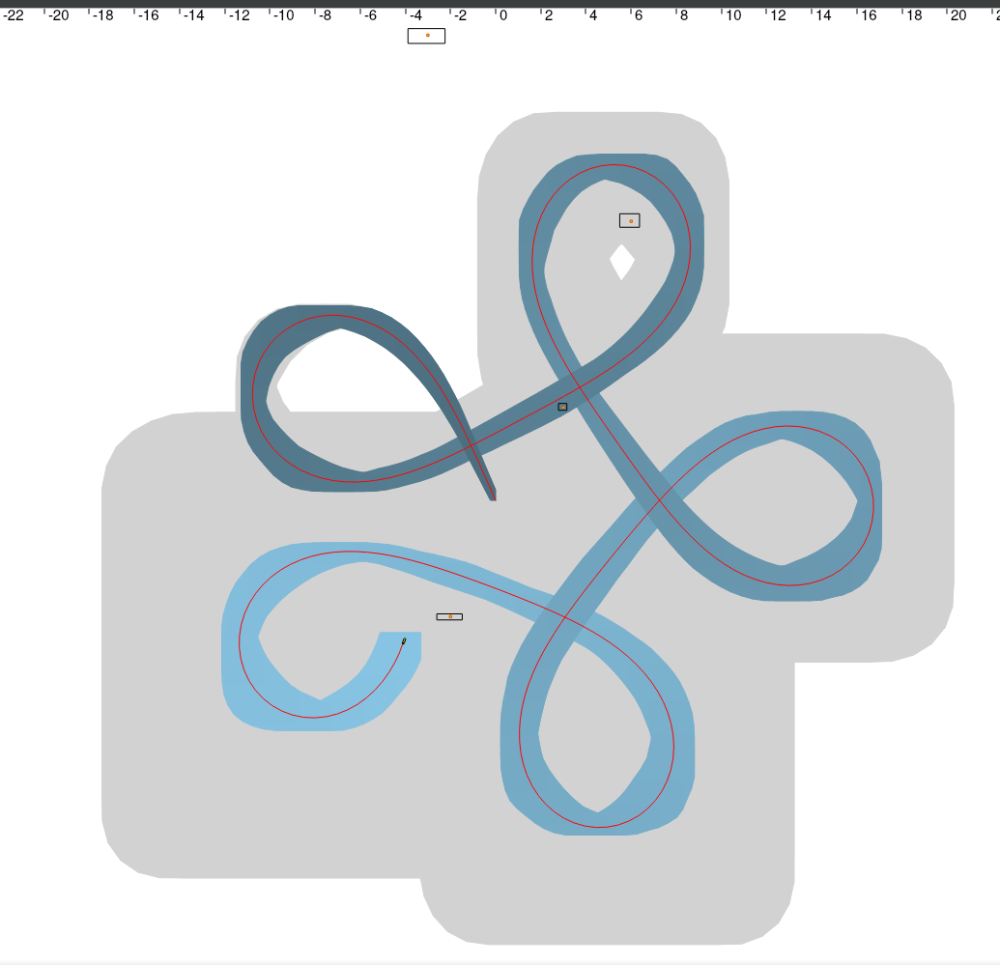
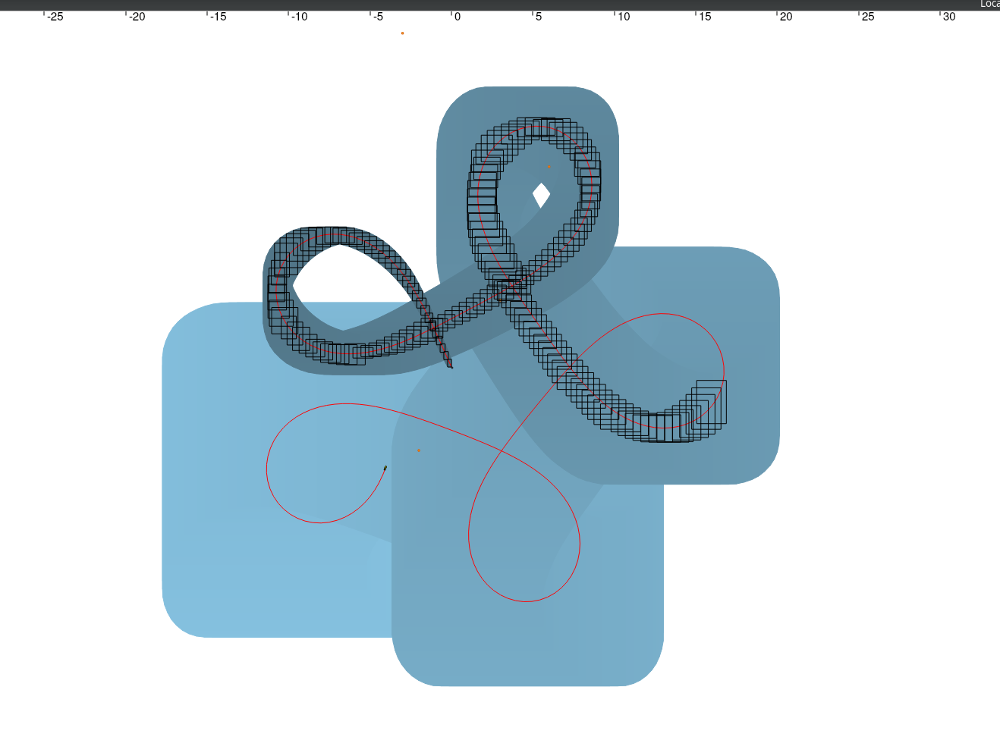

# Constraint SLAM
This program is a SLAM implementation using constraint programming approch.
It uses the range and bearing observations of random landmarks with unknwown coordinates to improve it's spacial position estimation.
In this scenario, the robot knows its starting coordinates.

Using Ibex and Tubex 

## Inital system state: Dead reckoning estimation

Here the real robot trajectory is displayed as a red line, and the markers as orange boxes.
The blue area can be interpreted as the robots' position uncertainty, when using only the integrated sensors (from an INS) and intergating the position. 
This method shows an increasing drift in the position uncertainty.

## Using obstacle range and bearing observations

In this scenario, the robot is able to detect and identify a random marker at each dt.
The position of the obstacle is unknown, and we only have distance and bearing informations, with a margin of error.

Thoses informations are then feeded into a Tubex contrator network as constraints on the robot position, which allow for a better position estimation.

The result is shown as the blue tube, much better than the initial dead reckoning approch.
The marker positions have also been calculated with a margin of error, and are displayed as black boxes.

## Using real time estimation

This time, we make each estimation at each dt. 
The result is a chain of boxes, each containing with certainty the robot position.
This result varies from the last one because we cannot constraint the position with the futur observations like we did previously.

This implementation could be integrated in an autonomous robot, to reduce the uncertainty on the actual robot position.

A big thanks to Simon Rohou for the course "Constraint Programming for Mobile Robotics" on which this program is based.
Link: http://simon-rohou.fr/research/tubex-lib/doc/index.html
